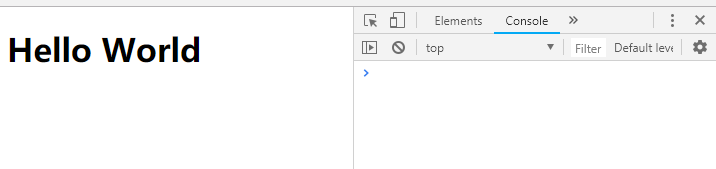
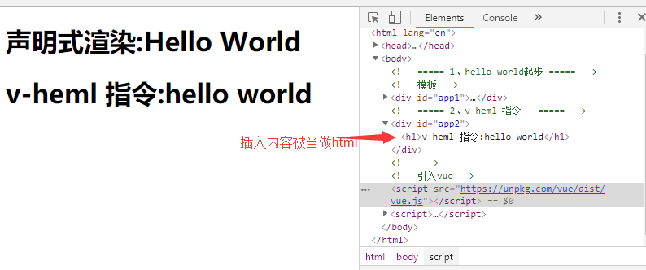
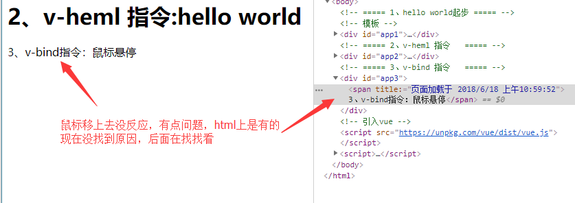
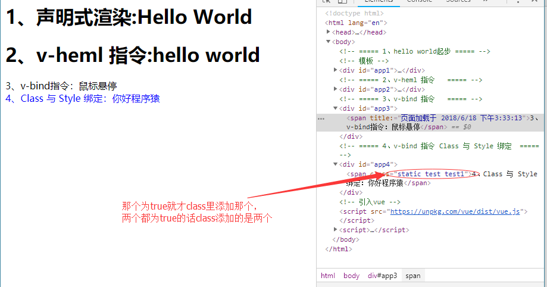
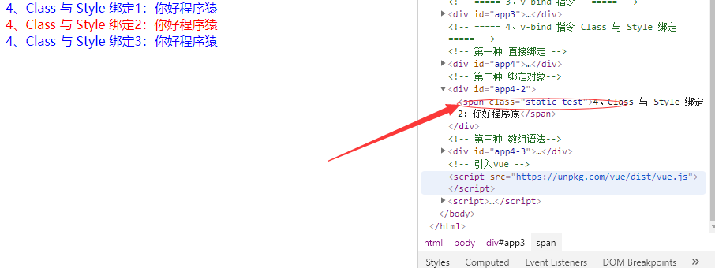
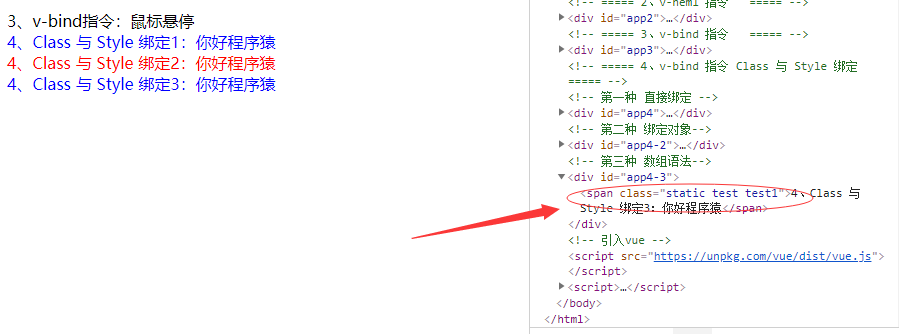

## 基础用法(没有搭建框架就在html文件里演示)
### 一、 Hello World起步

	<!DOCTYPE html>
	<html lang="en">
	<head>
		<meta charset="UTF-8">
		<title>Hello World</title>
	</head>
	<body>
		<!-- 模板 -->
		

			<!-- 声明式渲染 -->
			<h1>{{ msg }}</h1>
		

	
		<!-- 引入vue -->
		
		
	</body>
	</html>
浏览器显示如图:

###二、模板语法
####2.1、v-html指令
双大括号会将数据解释为纯文本，而非 HTML 。为了输出真正的 HTML ，你需要使用 v-html 指令 被插入的内容都会被当做 HTML —— 数据绑定会被忽略。注意，你不能使用 v-html 来复合局部模板，因为 Vue 不是基于字符串的模板引擎。组件更适合担任 UI 重用与复合的基本单元  

	<html>
	<!-- ===== 2、v-heml 指令   ===== -->
	

	<!-- script -->
		// 2、v-heml 指令
		let app2 = new Vue({
			el: '#app2',
			data() {
				return {
					rawHtml: '<h1>v-heml 指令:hello world</h1>'
				}
			}
		})
浏览器显示如图：

####2.2、V-bind指令
> v-bind 属性被称为指令。指令带有前缀 v-，以表示它们是 Vue.js 提供的特殊属性。这个指令的简单含义是说： 将这个元素节点的 title 属性和 Vue 实例的 message 属性绑定到一起。  

	<html>
	<!-- ===== 3、v-bind 指令   ===== -->
		

			3、v-bind指令：鼠标悬停
		

	
	<script>
			let app3 = new Vue({
				el: '#app3',
				data() {
					return {
						message: '页面加载于 ' + new Date().toLocaleString(),
						title: '你好程序猿'
					}
				}
			})
浏览器显示如图： 
没找到悬停时显示不出来的原因，后面在看看

####2.3、Class 与 Style 绑定
#####我们也可以在对象中传入更多属性用来动态切换多个 class 。此外， v-bind:class 指令可以与普通的 class 属性 共存。如下模板:

> 第一种：  绑定某一个 Class  

	<css>
		.test {
			color: red;
		}
		.test1 {
			color: blue;
		}
	
	<html>
	<!-- ===== 4、v-bind 指令 Class 与 Style 绑定  ===== -->
	

		<!-- 这个class是取决于isActive和hasError那个为true -->
		4、Class 与 Style 绑定：你好程序猿
	

	
	<js>
	// 4、v-bind 指令 Class 与 Style 绑定
	let app4 = new Vue({
		el: '#app4',
		data: {
			isActive: false,
			hasError: true
		}
	})

浏览器显示效果如图：   

> 第二种： 直接绑定数据里的一个对象  

	<css>
		.test {
			color: red;
		}
		.test1 {
			color: blue;
		}
	
	<html>
	<!-- ===== 4、v-bind 指令 Class 与 Style 绑定  ===== -->
	

		4、Class 与 Style 绑定2：你好程序猿
	

	
	<js>
	let app4A = new Vue({
		el: '#app4-2',
		data: {
			classObj: {
				test: true,
				test1: false
			}				
		}
	})

浏览器显示效果如图： 

> 第三种： 数组语法  

	<css>
		.test {
			color: red;
		}
		.test1 {
			color: blue;
		}
	
	<html>
	<!-- ===== 4、v-bind 指令 Class 与 Style 绑定  ===== -->
	

		4、Class 与 Style 绑定3：你好程序猿
	

	
	<js>
	let app4B = new Vue({
		el: '#app4-3',
		data: {
			active: 'test',
			active2: 'test1'				
		}
	})

浏览器显示效果如图： 

绑定内嵌style就不说了可以查一下，和这个差不多！！！！

####2.4、条件与循环
> 第一种： v-if
  
	<html>
	

		<!-- 通过if else 指令来控制元素的显示 -->
		
5、if: 我喜欢写代码

		
5、else: 我不喜欢写代码

	

	
	<js>	
	let app5 = new Vue({
		el: '#app5',
		data: {
			ifElse: false				
		}
	})  

	还可以这样判断，这里就不在做例子了
	
  A 
 
	
  B 

	
> 第二种： v-for  

	<html>
	

		<!-- 数组 -->
		<ul>
			<li v-for="(item, index) in arr">
				5、for数组：{{index}}: {{item}}
			</li>
		</ul>
		<!-- 对象 -->
		<ul>
			<li v-for="(value, key, index) in obj">
				5、for对象： {{index}}: {{key}}={{value}}
			</li>
		</ul>
	

	
	<js>
	
	let app5A = new Vue({
		el: '#app5-1',
		data: {
			// 数组
			arr: ['zhangsan', 'lisi', 'guanyu'],
			// 对象
			obj: {
				name: 'zhangsan',
				age: 21,
				gender: 'male'
			}			
		}
	})
	
	迭代整数
	
{{ n }}

	结果： 1 2 3 4 5 6 7 8 9 10

####2.5:、处理用户输入

	<html>
	<!-- 第一种： v-on 指令 -->
	

		
6、v-on：{{msg}}

		<!-- v-on 指令绑定一个监听事件用于调用我们 Vue 实例中定义的方法 -->
		<button v-on:click="reverseMsg">6、v-on：点击</button>
	

	<!-- 第二种： v-model 指令 -->
	<!-- 在表单输入和应用状态中做双向数据绑定 -->
	

		
6、v-model：{{msg}}

		<input type="text" v-model="msg">		
	

	
	<js>
	// 第一种： v-on指令
	// 在监听事件中触发对 this.data的修改
	let app6 = new Vue({
		el: '#app6',
		data: {
			msg: 'hello vue'
		},
		methods: {
			reverseMsg: function() {
				// this.msg 是指的data中的msg属性
				// 当this.data 中的属性值发生变化，视图也会重新渲染
				this.msg = this.msg.split('').reverse().join('')
			}
		}
	})
	// 第二种： v-model 指令
	// 在表单输入和应用状态中做双向数据绑定
	let app6A = new Vue({
		el: '#app6-1',
		data: {
			msg: 'hello 程序员'
		}
	})

### 三、组件

#### 3.1 组件是什么
> 组件可以扩展HTML元素，封装可重用的代码。在较高层面上，组件是自定义元素，Vue.js的编译器为它添加特殊功能。在有些情况下，组件也可以是原生HTML元素形式，以is特性扩展。

#### 3.2 组件的注册或创建

	<html>
	<!-- 全局注册 -->
	

		<hello></hello>
	

	<!-- 局部注册 -->
	

		<hello></hello>
	

	
	<js>
	// 全局注册
	Vue.component('hello', {
		template: '
7、全局注册：Hello World
'
	})
	
	let app7 = new Vue({
		el: '#app7'
	})
	
	// 局部注册: 通过使用组件实例选项注册，可以使用组件仅在另一个实例/组件的作用域中可用
	let helloVue = {
		template: '
7、局部注册： Hello World
'
	}
	let app7A = new Vue({
		el: '#app7-1',
		components: {
			'hello': helloVue
		}
	})

=

	注意：当使用DOM作为模板时（例如，将el选项挂载到一个已存在的元素上），
	你会受到HTML的一些限制，因为Vue只有在浏览器解析和标准化HTML后才能获取模板内容。
	尤其像这些元素<ul> <ol> <table> <select>限制了能被它包裹的元素，<option>只能出现在其它元素内部。
	例如： 

	<html>
	//这个会报错
	<table id="app7-2">
		<!-- 自定义组件 <my-row>被认为是无效的内容，因此在渲染的时候会导致错误 -->
		<my-row></my-row>
	</table>

	//这个是正确的
	<table id="app7-3">
		<!-- 变通的方法，使用特殊的is属性 -->
		<tr is="my-tr"></tr>
	</table>

	<js>
	// 特殊
	let trRow = {
		template: `
			<tr>
				<td>7、特殊： is： HTML/</td>
				<td>7、特殊： is： CSS/</td>
				<td>7、特殊： is： JS</td>
			</tr>
		`
	}

	let app7B = new Vue({
		el: '#app7-3',
		components: {
			'my-tr': trRow
		}
	})