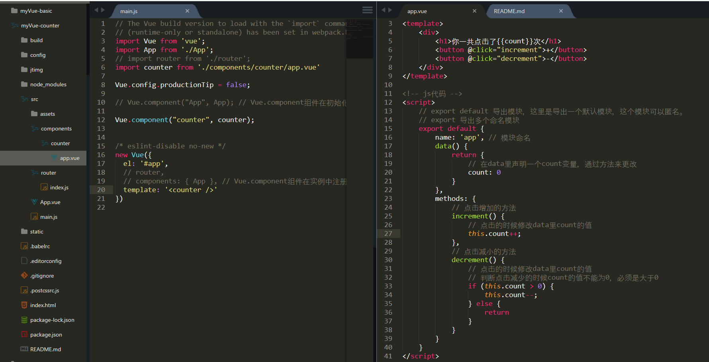

# vue-demo

> A Vue.js project

## Build Setup

``` bash
# install dependencies
npm install

# serve with hot reload at localhost:8080
npm run dev

# build for production with minification
npm run build

# build for production and view the bundle analyzer report
npm run build --report
```

For a detailed explanation on how things work, check out the [guide](http://vuejs-templates.github.io/webpack/) and [docs for vue-loader](http://vuejs.github.io/vue-loader).


## vue-demo

> 框架搭建好过后输入npm run dev的时候不会直接打开浏览器，在config文件夹找到index.js文件夹 把autoOpenBrowser: false改为autoOpenBrowser: true，从新在命令行输入npm run dev，这是就会自动打开浏览器。 如图修改 


### 现在做个简单的demo示例：counter(计数器)

#### 一、文件夹与文件的创建
* 1、首先要在components文件夹下面创建counter的一个文件夹
* 2、然后在counter文件夹里创建文件app.vue，然后就可以开始写代码了

代码如图：  
 
 上面代码就是这个简单的vue应用，左边是main.js里面注册组件的代码，右边是我们写的计数器的代码，点击加（“+”）或者减（“-”）的时候浏览器上面的点击次数会变化，就是代码里面data里的count这个变量或发生变化  

网页显示如图：


