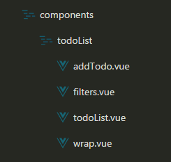

# vue-demo

> A Vue.js project

## Build Setup

``` bash
# install dependencies
npm install

# serve with hot reload at localhost:8080
npm run dev

# build for production with minification
npm run build

# build for production and view the bundle analyzer report
npm run build --report
```

For a detailed explanation on how things work, check out the [guide](http://vuejs-templates.github.io/webpack/) and [docs for vue-loader](http://vuejs.github.io/vue-loader).


## vue-demo实战todoList

> 框架搭建好过后输入npm run dev的时候不会直接打开浏览器，在config文件夹找到index.js文件夹 把autoOpenBrowser: false改为autoOpenBrowser: true，从新在命令行输入npm run dev，这是就会自动打开浏览器。 如图修改 


### 现在做个简单的demo示例： todo list

#### 一、文件夹与文件的创建
* 1、首先要在components文件夹下面创建todoList的一个文件夹
* 2、在todoList文件夹里创建addTodo.vue（新增组件）、filters.vue（过滤组件）、todoList.vue（列表组件）、wrap.vue（入口组件）这四个vue文件（四个组件）  
结构如图：   
* 3、在main.js中注册模板:  


