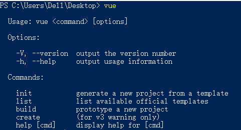
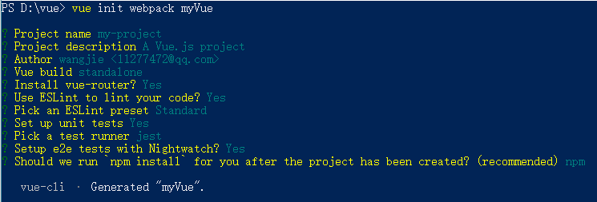
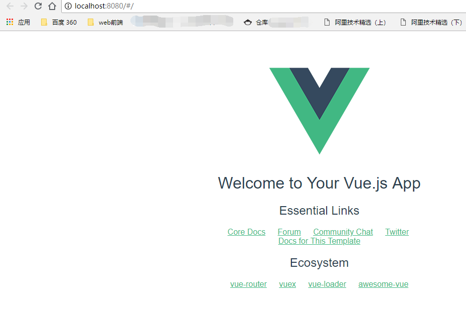

# vue项目搭建

> A Vue.js project

## Build Setup（vue项目创建后的一些命令）

``` bash
# install dependencies
npm install

# serve with hot reload at localhost:8080
npm run dev

# build for production with minification
npm run build

# build for production and view the bundle analyzer report
npm run build --report

# run unit tests
npm run unit

# run e2e tests
npm run e2e

# run all tests
npm test
```

For a detailed explanation on how things work, check out the [guide](http://vuejs-templates.github.io/webpack/) and [docs for vue-loader](http://vuejs.github.io/vue-loader).


  

## 构建项目

#### 一、安装全局vue-cli脚手架  
> 1、$ npm install -g vue-cli  
> 2、$ vue (安装完成后输入检查vue是否安装成功，成功如图)  

#### 二、创建项目  
> * 1、首先选择项目存放的位置
> * 2、创建项目  
  $  vue init webpack myVue (这里不是用npm而是用的vue，这里是创建webpack和vue，myVue名字是自定义)，如图依次操作（看个人情况，我这里是一直回车到下面白字出现）如图
> * 3、安装依赖 $ npm i
> * 4、现在输入$ npm run dev 命令会报错，因为现在命令行路径还停留在D:\vue，项目所在的位子是D:\vue\myVue,现在把命令行转到项目所在的目录在运行$ npm run dev
> * 5、如果搭建成功在浏览器上如图显示

### 三、项目结构
> * build: webpack相关配置文件
> * config: webpack相关配置文件
> * jtimg: 配置vue截图img，做项目时删除
> * node_modules: npm 依赖代码库
> * src: 项目原码
> * static: 纯静态资源（直接复制）
> * test: 单位测试
> * .babelrc: babe配置
> * .editorconfig: 编辑器配置
> * .eslintignore: 忽略语法检测的目录文件
> * .eslintignore: eslint 配置文件
> * .gitignore: 忽略提交git的目录
> * index.html： 项目入口文件
> * package.json: 构建脚本和依赖关系